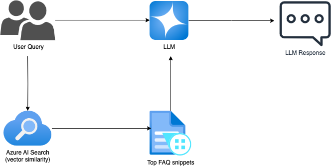
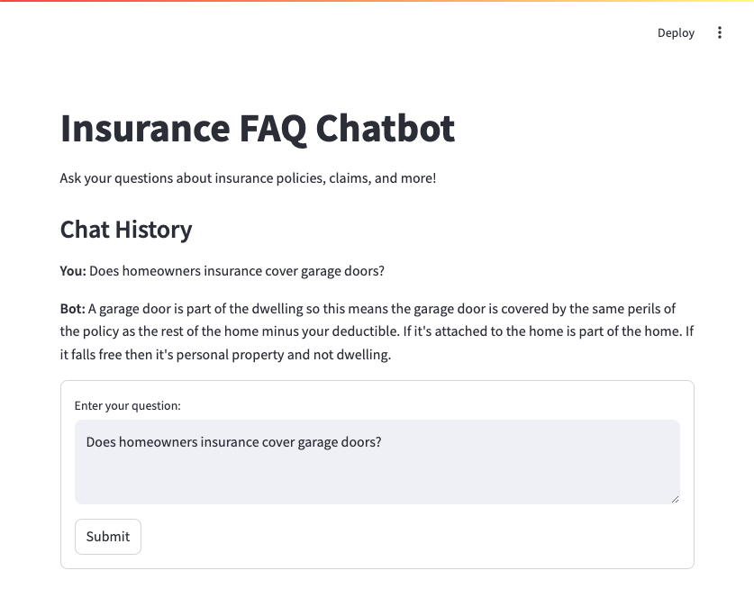

# 🧠 Insurance FAQ Chatbot (Generative AI Prototype)

A next‑generation FAQ chatbot for insurance, built with **RAG architecture** using **Azure AI Search**, **Azure OpenAI**, and **LangChain**. No manual intents or entity models—just indexed FAQs and real-time generation.

---

## 🚀 Why This Project Matters

- **Fast deployment**: Goes from CSV to chatbot in less than a day—no training required.
- **Accurate responses**: Only uses approved content from your FAQ dataset.
- **Human-level engagement**: Natural, conversational answers that understand context.
- **Scalable & future‑proof**: Easily extend across products (e.g., home, motor) or channels (web, bot).

---

## 🎯 Features

- **Semantic similarity search** via Azure AI Search  
- **RAG pipeline** orchestrated by LangChain  
- **LLM-powered answers** through Azure OpenAI (e.g., `gpt-4.1`)  
- **Modular LLM support**: Swap Azure OpenAI, OpenAI, or Ollama models  
- **Simple CLI interface** for testing queries

---

## ⚙️ Architecture



- FAQ dataset is transformed into document chunks  
- Chunks are indexed in Azure AI Search with embeddings  
- On query: similar chunks retrieved, combined into prompt  
- LLM generates a grounded, accurate response


## Prerequisite

- Azure AI Search
- Azure OpenAI or OpenAI or Ollama

To simply the deployment of Azure AI Search, Azure OpenAI, embedding and gpt model, run the following terraform command:

```bash
cd infra
terraform init
terraform apply
```

## 📦 Getting Started

### 1. Clone the repo
```bash
git clone https://github.com/samtin/genai_faq_chatbot.git
cd genai_faq_chatbot
python -m venv .venv
source .venv/bin/activate
```
### 2. Install dependencies
``` bash
pip install -r requirements.txt
```

### 3. Set up environment variables

Create a `.env` file with:
```env
AZURE_OPENAI_ENDPOINT=
AZURE_OPENAI_API_KEY=
LLM_PROVIDER=
AZURE_SEARCH_ENDPOINT=
AZURE_SEARCH_ADMIN_KEY=
LLM_PROVIDER=azure_openai  # or openai, ollama
```
### 4. Load FAQ data into vector store
In __main__ of knowledge_base.py, uncomment the line that call "create_vector_store()"
```bash
if __name__ == "__main__":
    # create_vector_store()  # Uncomment to create the vector store if not already created

    # Example usage
    query = "Does homeowners insurance cover garage doors?"
    results = similarity_search(query, k=4)
    
    for doc in results:
        print(f"Document: {doc.page_content}\n")
        print(f"Metadata: {doc.metadata}\n")
```
Run knowledge_base.py

```bash
python
>>> python knowledge_base.py
```
### 5. Test locally
```bash
python
>>> from app import query_llm
>>> print(query_llm("Does homeowners insurance cover garage doors?", k=4).content)
```

## ⚙️ Optional: Streamlit Chat UI
Run:
```bash
streamlit run chat_ui.py
```
to launch a web-based chat interface.



## Promt Template used:

```
template="""
        You are a helpful contact centre agent of an big insurance company. You will answer user enquiry based on provided dataset snippets.
        The dataset is about insurance questions and answers. The dataset contains 3 colummns: id, question, answer.
        You must answer the user query using the exact answer from the dataset snippets and do not make up any answers.
        User query: {user_query}
        Dataset snippets: {docs}
        """
```

## 🧱 Code Structure
``` folder
.
├── app.py             # Core logic: vector store + query_llm()
├── chat_ui.py         # Streamlit-based chat frontend
├── create_index.py    # (optional) indexing FAQ into Azure Search
├── requirements.txt
└── README.md
```

## 📌 Customize & Extend
📄 FAQ Dataset: Replace CSV with richer data (PDFs, DOCX)

💬 LLM Variants: test with gpt‑4, openai, or local Ollama models

📊 Frontend: Add citation links, chat history, voice UI

🔁 Deployment: Containerize with Docker, deploy to Azure App Service


## 📈 Business Impacts
💸 Reduce call center costs by 20–40% via self-service

⏱ Deliver solutions 10× faster than intent-based bots

✅ Ensure compliance—answers only from approved sources

🔄 Extendable to other business domains or internal support


## 🤝 Contributions & Feedback
This is a prototype—your feedback or PRs to:

Support new data formats

Local LLM integration

Frontend improvements

Feel free to fork, raise issues, or connect via LinkedIn/email.


## Author

- GitHub: [@samueltin](https://github.com/samueltin)
